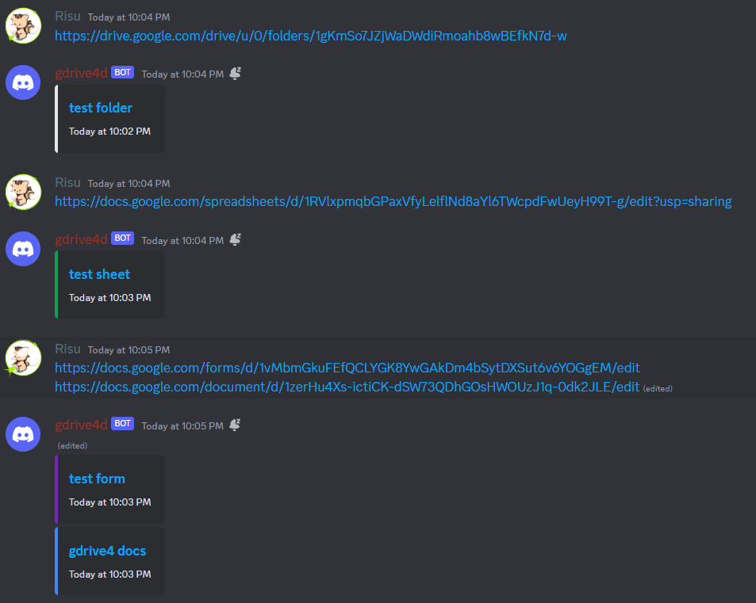

# gdrive4d

Discord Bot generates embeds for Google Drive links, including private files.

## Features

- Generate embeds with links, filenames, and last edited time in Discord for Google Drive links.

- Support private (access restricted) files and folders.

- Support multiple Google Drive links in a single message.

- Support editing and deleting messages. The embeds will be updated accordingly.



## Getting Started

### Prerequisite

- [bun](https://bun.sh/docs/installation)

### Setup

0. Clone this repository and make sure you installed the prerequisite.

1. Run the following commands:  
```sh
bun i
cp .env.example .env
```

2. Create a Google Cloud project

   1. Go to [Google Cloud Console](https://console.cloud.google.com/) and create a new project.
   (Click `Select a project` in the top left corner and click `New Project`.)

   2. Go to the [Google Drive API](https://console.cloud.google.com/apis/library/drive.googleapis.com) in API library and enable it.

   3. Move to the [Service Accounts](https://console.cloud.google.com/projectselector2/iam-admin/serviceaccounts) and create a new service account. You may skip all optional steps.

   4. Move to the Keys tab and create a new key. (Click `Add Key` and select `Create new key`.)
   Select JSON as the key type and download the key file.

   5. Copy the `client_email` in the key file and paste it to `.env` as `GOOGLE_SERVICE_ACCOUNT_EMAIL`.

   6. Copy the `private_key` in the key file and paste it to `.env` as `GOOGLE_SERVICE_ACCOUNT_KEY`.
   Leave the `\n` as it is, including the key's last `\n`.

3. Share Google Drive folders/files to the service account

   1. Go to the Google Drive folder/file you want to share.

   2. Click the `Share` button in the context menu or the top right corner.

   3. Paste the `GOOGLE_SERVICE_ACCOUNT_EMAIL` in the `Add people and groups` field and click `Done`.

   4. Repeat the above steps for all folders/files you want to share.
   For convenience, I recommend sharing entire folders instead of individual files.

4. Create a Discord bot

   1. Go to [Discord Developer Portal](https://discord.com/developers/applications) and create a new application.

   2. Move to the Bot tab and reset the token.

   Copy and paste it to `.env` as `DISCORD_BOT_TOKEN`.

   3. Enable `Message Content Intent` in the Bot tab.

   4. Disable the `Public Bot` option to prevent your bot from being added to other servers.

5. Invite the bot to your server

   0. Open Discord and enable Developer Mode in `User Settings > App Settings > Advanced`.

   1. Go to the server you want to add the bot to.

   2. Right-click the server icon and `Copy Server ID`.
   Paste it to `.env` as `DISCORD_GUILD_ID`.

   3. Run the following command to generate an invite link for the bot.
   It exits with an error, but it's okay.
   ```sh
    bun start
    ```

    4. Follow the link and add the bot to the server.

> [!IMPORTANT]
> Do not include the `"` at the beginning and the end of the values in `.env`.

### Run

```sh
bun start
```

If you want to run it persistently, use the following command instead.
It requires [screen](https://www.gnu.org/software/screen/) to be installed. (Which is usually installed by default.)  
*Make sure to detach (Ctrl+A, D) before closing the terminal, or it will be terminated.

```sh
bun start:screen
```

## License

MIT
